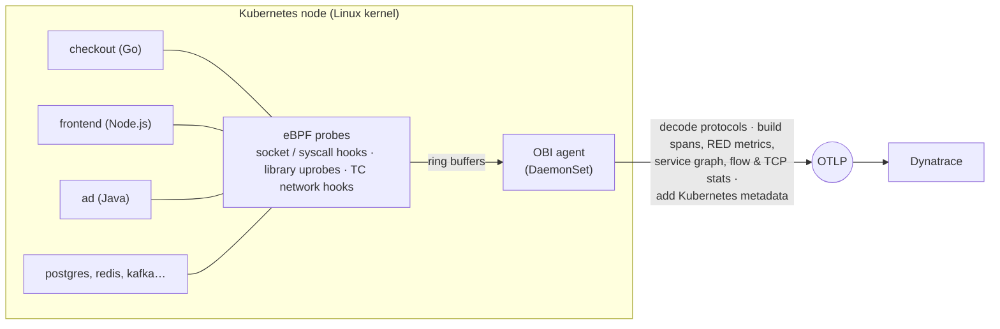

# OBI (eBPF) Zero-Code Observability on the OpenTelemetry Astronomy Shop

A working reference for **OpenTelemetry eBPF Instrumentation (OBI)**: a polyglot,
20+ service microservice application observed end to end **without adding an SDK,
agent, sidecar or code change to any service**, with all telemetry exported over
OTLP to Dynatrace.

This repository is a fork of the
[OpenTelemetry Demo](https://github.com/open-telemetry/opentelemetry-demo)
("Astronomy Shop"), deployed on Kubernetes with Kustomize + Argo CD, plus the
OBI deployment, the configuration that makes OBI the *only* telemetry source,
and the material that explains how it works.

> The original upstream README is preserved at
> [`docs/UPSTREAM_README.md`](docs/UPSTREAM_README.md).

| I want to… | Go to |
|---|---|
| Understand what OBI is and how it instruments code | [What OBI is](#what-obi-is) and [`docs/obi/how-obi-instruments.md`](docs/obi/how-obi-instruments.md) |
| See what it captured per language | [Results by language](#what-obi-captured-in-this-demo) |
| Know whether L3/L4 network data is possible | [Network layer (L3/L4)](#network-layer-l3--l4-data) |
| Deploy or reconfigure it | [`k8s/obi/README.md`](k8s/obi/README.md) |
| Import the explanatory Dynatrace notebook | [`docs/obi/dynatrace-notebook.json`](docs/obi/dynatrace-notebook.json) |
| Know what it can't do | [Limits](#honest-limits) |

---

## What OBI is

OBI is an OpenTelemetry project that uses **eBPF** — small, kernel-verified
programs loaded into the Linux kernel — to observe applications from the outside.
It runs as **one privileged DaemonSet per node**. It watches the processes on
that node, attaches probes to them, and turns what it sees into standard
OpenTelemetry **traces, metrics and network-flow data**.

- **No code changes, no rebuilds, no restarts.** Services run as they were built.
- **One agent for every language.** The same OBI pod instruments Go, Java, .NET,
  Node.js, Python, Ruby, PHP, Rust and native C/C++ processes, plus databases and
  brokers you could never put an SDK into (PostgreSQL, Redis, Kafka).
- **Standard output.** OTLP, with Kubernetes metadata attached, to any backend.

### How it instruments (short version)



1. **Discover.** OBI finds processes on the node and selects the ones matching
   its rules (here: namespace `otel-demo`). It classifies each by runtime
   (Go, Java, .NET, Node.js, Python, …) from the executable itself.
2. **Attach.** It attaches eBPF probes: to the kernel's socket/network paths
   (works for *every* language), to functions inside the process where that adds
   precision (for example Go libraries and TLS libraries), and to network
   interfaces for flow data.
3. **Decode.** Raw events are reassembled in user space into requests and
   responses and parsed as HTTP, HTTP/2, gRPC, SQL, Redis, Kafka and more.
4. **Enrich & export.** Spans and metrics are decorated with `k8s.*` attributes
   and sent as OTLP.

Full detail, per-language behaviour and the exact limits we measured are in
[`docs/obi/how-obi-instruments.md`](docs/obi/how-obi-instruments.md).

---

## Architecture of this deployment

```
 Astronomy Shop (otel-demo namespace, ~25 workloads, many languages)
        │   unmodified services — no telemetry leaves them
        ▼
   OBI DaemonSet (obi namespace) ── eBPF on the node ──► OTLP/HTTP ──► Dynatrace
        ▲
   Argo CD  ◄── k8s/obi/values.yaml  (OBI Helm chart 0.13.0, app v0.12.2)
```

- Cluster: single-node Kubernetes (OrbStack on macOS, Linux 7.0 kernel); also
  suitable for any Linux node ≥ 5.8 with BTF.
- GitOps: Argo CD applies `k8s/overlays/demo` (the shop) and `k8s/argocd/obi-application.yaml`
  (OBI, from the official Helm chart + `k8s/obi/values.yaml`).
- OBI exports **directly** to Dynatrace; credentials live in a Kubernetes Secret
  created out-of-band (never committed) — see [`k8s/obi/README.md`](k8s/obi/README.md).

### OBI is the only telemetry source (and how that's enforced)

The shop's services still contain their original OpenTelemetry SDK code. To make
the data in Dynatrace **purely OBI-produced**, three controls are applied:

| Control | Where | Effect |
|---|---|---|
| App-side collector no longer forwards to Dynatrace and **no longer listens for OTLP** | `k8s/overlays/demo/patches/collector-dynatrace-export.yaml` | Any SDK export is refused at connect; nothing app-side is delivered |
| `OTEL_*_EXPORTER=none` on every service | `k8s/overlays/demo/patches/disable-app-sdk.yaml` | Silences SDKs that honour the standard env vars (Java, Node, Python, Ruby) |
| OBI filter drops traffic addressed to the collector | `k8s/obi/values.yaml` (`filter.application`) | Stops OBI recording the apps' failed export retries as "telemetry" |

> **Honest note:** setting `OTEL_*_EXPORTER=none` alone is *not* enough. The Go,
> C++, Rust and .NET services (and Envoy) construct their exporters in code and
> ignore it, so their SDK data kept arriving until the collector change above.
> The SDKs remain in the source and running in the pods; their output is
> discarded. Removing them from the source would need rebuilt images.

Verify in Dynatrace (replace the cluster name if you change it):

```dql
fetch spans, from: now() - 15m
| filter k8s.cluster.name == "orbstack-obi-eval"
| summarize spans = count(),
    by:{source = if(telemetry.distro.name == "opentelemetry-ebpf-instrumentation", "OBI (eBPF)", else: "anything else")}
```

Use **equality** on `telemetry.distro.name`. `isNotNull(...)` is wrong: other
auto-instrumentation agents set their own distro names. Spans only — metrics are
identified by instrumentation scope (`go.opentelemetry.io/obi`,
`network_ebpf_events`, `stats_ebpf_events`).

---

## What OBI captured in this demo

Languages as **classified by OBI** (a runtime classification, not a statement
about how the service was built). Observed on this deployment:

| OBI classification | Services | What the data shows |
|---|---|---|
| Go | `product-catalog`, `checkout`, `flagd` | Client + server spans, parent/child links; richest coverage |
| Java | `ad`, `fraud-detection`, `kafka` | Spans plus **JVM memory** runtime metrics |
| .NET | `accounting` | Kafka consumer spans, PostgreSQL `INSERT` client spans |
| Node.js | `frontend` (Next.js), `payment` | HTTP/gRPC spans plus **event-loop** metrics |
| Python | `recommendation`, `product-reviews`, `llm`, `load-generator` | HTTP/gRPC spans |
| PHP / Ruby / Rust | `quote` / `email` / `shipping` | Protocol-level spans |
| Native / "generic" | `currency` (C++), `cart`, `postgresql`, `valkey-cart` (Redis), Envoy `frontend-proxy` | Protocol-level spans; DB/cache semantics decoded |

Beyond request telemetry, OBI also produced (all from the kernel, none requiring
workload cooperation): network flow bytes and packets, TCP RTT / retransmits /
failed connections / I/O, a service graph, DNS lookup timing and node-level host
info.

An importable Dynatrace notebook that renders all of this live —
**25 DQL tiles + explanatory text** — is in
[`docs/obi/dynatrace-notebook.json`](docs/obi/dynatrace-notebook.json).

---

## Network layer (L3 / L4) data

**Yes — it is feasible, and it is enabled here.** OBI captures network-layer data
independently of application protocols, using eBPF traffic-control (TC) hooks on
the node's network interfaces plus TCP socket statistics.

Enabled by two settings in [`k8s/obi/values.yaml`](k8s/obi/values.yaml):

```yaml
env:
  OTEL_EBPF_METRICS_FEATURES: "application,…,network,network_flow_packets,stats,…"
config:
  data:
    network:
      enable: true
```

| Metric | Meaning | Key attributes |
|---|---|---|
| `obi.network.flow.bytes` | L3/L4 bytes between two endpoints | source/destination workload, namespace, owner type, direction |
| `obi.network.flow.packets` | Packet counts | same |
| `obi.stat.tcp.rtt` | TCP round-trip time | source/destination workload, IPs |
| `obi.stat.tcp.retransmits` | TCP retransmissions | same |
| `obi.stat.tcp.failed.connections` | Failed connection attempts | destination workload, IPs |
| `obi.stat.tcp.io` | Bytes at the socket layer | same |

Observed here: **182 distinct workload-to-workload flows in 30 minutes**,
spanning `otel-demo`, `argocd` and `kube-system`, with endpoints that do not
resolve to a Kubernetes owner (external/node traffic) reported as such.

Things to know before enabling it elsewhere:

- It sees the **whole node**, not just instrumented namespaces. Scope it with
  `filter.network` (this repo excludes `kube*`, Prometheus and agent workloads).
- Needs `hostNetwork` and elevated capabilities (the Helm chart sets these) and a
  kernel with TC/BTF support.
- It counts bytes and packets; it does **not** read payloads, so it works for
  encrypted traffic but says nothing about the request inside it.
- Cardinality grows with the number of workload pairs — filter accordingly.
- If the cluster runs **Cilium**, OBI and Cilium both attach TC programs; they
  coexist when both use TCX (kernel ≥ 6.6, the default in recent Cilium).
  See the OBI/Cilium compatibility page in the upstream docs.

---

## Honest limits

Measured on this deployment (single node, 2026-10-01); treat as indicative.

- **Partial trace stitching.** ~81% of traces contained a single service, ~16%
  two, ~3% three. Cross-service linking works but is not end-to-end everywhere.
- **No business context.** OBI cannot attach application-level attributes (for
  example the currency codes in a conversion call). Custom spans need an SDK.
- **gRPC method names can be lost** for some native services (`currency`: ~99% of
  spans reported the method as `*`).
- **Service naming fallbacks.** Some Go/Python/Java processes were reported
  under the namespace name when OBI could not derive a better one.
- **SQL text is not captured** — operation and table only.
- **Runtime metrics are partial:** JVM and Node.js were received; Go, .NET and
  Python runtime metrics were not.
- **OBI skips services it detects as already OpenTelemetry-instrumented by
  default** (`exclude_otel_instrumented_services`).
- **Resource cost depends on process churn, not just traffic.** Headless-browser
  processes in the load generator made OBI restart repeatedly (OOM at 6 GiB);
  excluding them brought it to a steady ~300 MiB.

---

## Repository map

| Path | What |
|---|---|
| `k8s/obi/values.yaml` | **OBI configuration** (Helm values) |
| `k8s/obi/README.md` | Operating OBI: secrets, config reference, troubleshooting |
| `k8s/argocd/obi-application.yaml` | Argo CD Application that deploys OBI |
| `k8s/overlays/demo/` | The shop (Kustomize overlay); collector and SDK-silencing patches in `patches/` |
| `docs/obi/how-obi-instruments.md` | Deep dive: mechanics, per-language behaviour, protocols, limits |
| `docs/obi/dynatrace-notebook.json` | Importable Dynatrace notebook (live DQL) |
| `docs/UPSTREAM_README.md` | Original OpenTelemetry Demo README |

Other directories (`src/`, `pb/`, …) are the upstream demo's services. This fork
also carries unrelated experiments (`GEOMETRY-LAB.md`); they are not part of the
OBI work.

## References

- [OBI documentation](https://opentelemetry.io/docs/zero-code/obi/)
- [OBI distributed traces / context propagation](https://opentelemetry.io/docs/zero-code/obi/distributed-traces/)
- [OBI and Cilium compatibility](https://opentelemetry.io/docs/zero-code/obi/cilium-compatibility/)
- [OpenTelemetry Demo (upstream)](https://github.com/open-telemetry/opentelemetry-demo)
