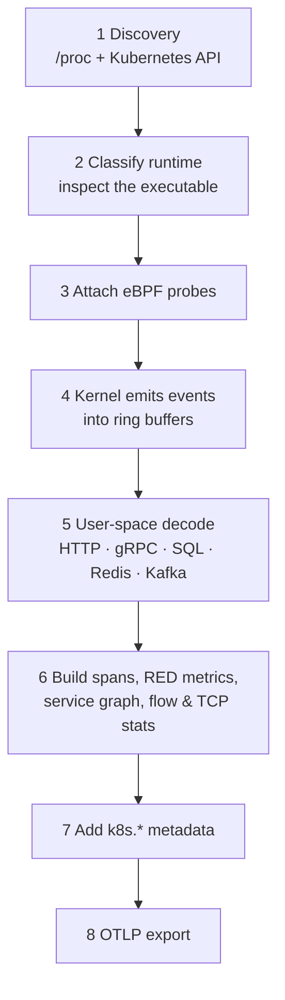

# How OBI instruments applications

A technical explanation of OpenTelemetry eBPF Instrumentation (OBI), written
against what we observed running it on the Astronomy Shop. Statements are tagged:

- **[docs]** — stated in the upstream OBI documentation
  (<https://opentelemetry.io/docs/zero-code/obi/>)
- **[source]** — read in the OBI v0.12.2 source code
  (<https://github.com/open-telemetry/opentelemetry-ebpf-instrumentation/tree/v0.12.2>)
- **[observed]** — measured on this deployment (single-node Kubernetes, Linux
  7.0 kernel, OBI Helm chart 0.13.0 / OBI v0.12.2, October 2026)

Anything untagged is general eBPF background. Probe-level details change between
OBI versions; treat the upstream docs as authoritative for specifics.

---

## 1. The idea

Conventional instrumentation lives **inside** the application: an SDK, a language
agent, or a sidecar. OBI lives **beside** it. It is a single privileged agent per
node that uses eBPF to watch the application's behaviour from the kernel and from
the process's own memory, and reconstructs requests, database calls and message
operations from that.

Consequences:

| | In-process SDK / agent | OBI |
|---|---|---|
| Code change / rebuild | Required (or agent flag + restart) | None |
| Per-language work | One SDK per language, versioned separately | One agent for all languages |
| Covers third-party binaries (databases, proxies, brokers) | No | Yes |
| Application-level context (user ID, cart contents, custom spans) | Yes | No |
| Runs with the app's privileges | Yes | Needs elevated node privileges |

[docs] OBI "does not replace language-level instrumentation in every scenario":
custom spans and business attributes need an SDK, and details that are "not
visible from eBPF observation points" cannot be recovered.

## 2. Requirements and privileges

- [docs] Linux **5.8+** (RHEL 4.18 with backports), kernel **BTF** support,
  amd64 or arm64.
- [docs] Root or specific capabilities. For the Kubernetes DaemonSet: `hostPID`,
  `hostNetwork`, `/sys/fs/cgroup` mounted, and capabilities including `BPF`,
  `PERFMON`, `SYS_PTRACE`, `NET_RAW`, `NET_ADMIN`, `DAC_READ_SEARCH`,
  `CHECKPOINT_RESTORE`, plus `SYS_ADMIN` for Go library-level context
  propagation. The Helm chart configures these; this deployment runs the
  container privileged.
- [docs] If the kernel is in integrity lockdown mode
  (`/sys/kernel/security/lockdown` not `[none]`), `bpf_probe_write_user` is
  blocked, which disables Go library-level context propagation; network-level
  propagation is unaffected.

## 3. The pipeline, step by step



1. **Discovery.** OBI continuously watches node processes and Kubernetes
   metadata. Selection rules (`discovery.instrument`) decide what to instrument;
   exclusions (`discovery.exclude_instrument`) remove things such as OBI itself.
   [docs] Selectors include executable path, open ports, language, container,
   namespace, deployment/pod names, and labels/annotations.
   This deployment: instrument namespace `otel-demo`; exclude `*chrome*` and the
   idle Prometheus/Grafana/Jaeger/OpenSearch backends. OBI's built-in default
   exclusions (its own binary, `otelcol*`, …) are a separate setting and still
   apply.
2. **Classification.** OBI inspects the process's executable to decide its runtime
   (its logs print `type=go|java|dotnet|python|nodejs|ruby|rust|php|cpp|generic`).
   [observed] This is a classification of the *executable*, not of how the service
   was developed — a self-contained .NET app launched as a native `./cart` binary
   was classified as C++/native.
3. **Probe attachment.** Three families of eBPF probes are used (exact probe
   points vary by OBI version):
   - **Socket and syscall probes** in the kernel see data sent and received by any
     process regardless of language. This is why a Ruby, Rust and C++ service all
     produce spans with no language-specific work.
   - **User-space probes (uprobes)** attach to functions inside a process or
     shared library where that gives more precision — for Go libraries, and for
     TLS libraries (OpenSSL-style `SSL_*` functions, Go `crypto/tls`; per the
     v0.12.2 source) so encrypted traffic can be read at the library boundary,
     before encryption.
   - **Packet-level hooks** for network-flow metrics: a socket filter by default
     in v0.12.2, or traffic-control (TC) programs with `network.source: tc`. TC
     programs are also used for trace-context injection when context propagation
     is enabled.
4. **Events to user space.** Probes write compact event records into kernel ring
   buffers; the OBI agent reads them.
5. **Protocol decoding.** The agent reassembles request/response pairs and parses
   the protocol. [docs] Supported: HTTP/S, HTTP/2, gRPC, Kafka, NATS, MQTT,
   Memcached, SunRPC, JSON-RPC (client and server); AMQP 1.0 and DNS (client);
   PostgreSQL, MySQL, MSSQL, Redis, MongoDB, Couchbase, Elasticsearch,
   OpenSearch, Aerospike.
6. **Telemetry construction.** Spans, RED metrics (rate, errors, duration),
   service-graph metrics, and — if enabled — network and TCP statistics.
7. **Enrichment.** Kubernetes attributes (`k8s.namespace.name`, `k8s.pod.name`,
   `k8s.deployment.name`, `k8s.node.name`, `k8s.cluster.name`, …) are added from the
   API. [docs]
8. **Export.** OTLP (here HTTP/protobuf, delta temporality, direct to Dynatrace).

## 4. Distributed trace context

A trace crosses services only if something links one service's outgoing call to
the next service's incoming request.

- [docs] **Off by default.** In v0.12.2 `OTEL_EBPF_BPF_CONTEXT_PROPAGATION`
  defaults to `disabled`; the Helm chart's `contextPropagation.enabled` only grants
  the privileges it needs. This deployment now sets it to `all` (HTTP headers +
  TCP options).
- [docs] **Incoming:** with propagation enabled (or `track_request_headers`),
  OBI reads the W3C `traceparent` header; otherwise it creates a new trace ID.
  When both are off, non-Go services do not parse incoming headers at all.
- [docs] **Outgoing — Go (library level):** uprobes plus `bpf_probe_write_user`
  write context into process memory; Go 1.18+, up to six nested goroutine levels.
- [docs] **Outgoing — network level (any language):** inject `traceparent` into
  HTTP headers, add it to TCP/IP packets via TC, and for gRPC a per-stream HPACK
  header. Needs kernel ≥ 5.17 and `CAP_NET_ADMIN`.
- [docs] **Runtime-specific context tracking:** Node.js async hooks (8.0+),
  Python asyncio (3.9+ **with `uvloop`**, per OBI's support matrix; implemented with uprobes on CPython symbols, so a stripped `libpython`, as in `python:*-slim` and `-alpine`, disables it; see the root README), Java thread pools (JDK 8+), Ruby Puma
  (5.0+).
- [docs] Limits: L7 proxies and load balancers disrupt the TCP-level propagation;
  encrypted traffic can only carry context between two OBI-instrumented services;
  non-gRPC HTTP/2 propagation is Go-only.
- [observed] Services per trace, excluding health-probe traces (2026-10-01):
  with propagation **disabled** (v0.12.2 default; 30 min) 82% single-service,
  11% two–three, 7% four–six, none larger. With `all` (9 min): 78% single,
  9% two–three, 12% four–six, and 1.1% of traces spanning **10–11 services**
  (the full checkout path), which never appeared before. Linking improved
  clearly but remains partial. (An earlier ~81/16/3% figure also counted
  health-probe traces.) Go services show multi-service traces even with
  propagation off, consistent with Go's library-level propagation.

## 5. Per-language behaviour (as seen here)

| OBI classification | Services | What is distinctive |
|---|---|---|
| Go | `product-catalog`, `checkout`, `flagd` | Highest fidelity. Library-level context propagation [docs]. Client and server spans with parent/child links [observed]. |
| Java | `ad`, `fraud-detection`, `kafka` | JDK 8+ [docs]. OBI dynamically attaches its own Java agent (TLS plaintext + thread-pool context, reported via `ioctl`) and reads GC USDT probes in `libjvm.so` for `jvm.memory.*` [source, observed]. `ad` and `fraud-detection` also set the upstream OTel `-javaagent` in their Dockerfiles; confirmed loaded in `ad`, exporters off [observed]. |
| .NET | `accounting` | Normal (managed) .NET is handled at the protocol level: Kafka consumer spans and PostgreSQL client spans [observed]. No .NET-specific probes or runtime metrics in v0.12.2 [docs]. |
| Node.js | `frontend`, `payment` | OBI injects a small agent script into the running Node process for async-hook context tracking and event-loop metrics [docs]; `nodejs.eventloop.*` metrics [observed]. |
| Python | `recommendation`, `product-reviews`, `llm`, `load-generator` | Protocol-level. asyncio context tracking uses uprobes on CPython symbols (`task_step`, `context_run`, …) [source]; [observed] these images' `libpython` is stripped, so only the exported `PyContext_CopyCurrent` is hookable; the services use gRPC thread pools, not asyncio. |
| PHP | `quote` | Not in OBI's official supported-language list, but classified as `php` and decoded at protocol level; nothing PHP-specific visible in the data [observed]. |
| Ruby | `email` | Puma 5.0+ propagation [docs]; protocol-level spans [observed]. |
| Rust | `shipping` | Protocol-level; low volume in this demo [observed]. |
| C/C++ / native | `currency`, `postgresql`, `cart` | No runtime to hook; sockets and protocol parsing only. gRPC method names often unrecoverable (see §8) [observed]. |
| "generic" | `valkey-cart` (Redis), Envoy `frontend-proxy`, nginx-style proxies | Recognised processes with no language logic; protocol decoding still works [observed]. |

## 6. What the protocol decoding yields

[observed] Examples of the span attributes OBI produced with zero instrumentation:

| Protocol | Attributes captured |
|---|---|
| PostgreSQL | `db.system.name`, `db.operation.name` (e.g. `SELECT`, `INSERT`), `db.collection.name` (e.g. `accounting.order`), `server.address/port`. SQL text only if `db.query.text` is opted in via `attributes.select.traces` (off by default; may contain literals/PII). |
| Redis | `db.system.name=redis`, command (`HGET`, …) |
| Kafka | `messaging.system`, `messaging.destination.name` (topic), partition, **offset**, operation type (publish/process), client id |
| gRPC | `rpc.system.name`, `rpc.method` (when recoverable), status |
| HTTP | method, route, path, status code, request/response body size, client address |

## 7. Metrics beyond requests

Selected with `OTEL_EBPF_METRICS_FEATURES` [docs]. Enabled in this deployment:

| Feature group | Produces |
|---|---|
| `application` (default) | RED metrics: `http.server/client.request.duration`, `rpc.*.call.duration`, `db.client.operation.duration`, `messaging.*`, body sizes |
| `application_service_graph` | `traces_service_graph_request_*` (client → server edges) |
| `application_host` | Host-level application info (`traces.host.info`) |
| `application_runtime` | [docs] v0.12.2 defines Go (`go.memory.*`, `go.goroutine.count`, …), JVM (`jvm.memory.*`) and Node.js (`nodejs.eventloop.*`) runtime metrics; nothing for .NET or Python. [observed] JVM and Node.js arrived; Go did **not** (open gap). |
| `network`, `network_flow_packets` | `obi.network.flow.bytes`, `obi.network.flow.packets` (L3/L4) |
| `stats` | `obi.stat.tcp.rtt`, `.retransmits`, `.failed.connections`, `.io` (`stats_tcp_io` fires on every `tcp_sendmsg`, the costliest of the group) |

Not enabled: `ebpf` (OBI's own probe/map health). [docs] In v0.12.2 it is only
exposed through OBI's Prometheus exporter, never OTLP, so it cannot reach
Dynatrace directly; this deployment turns the Prometheus exporter off.

Also observed: `dns.lookup.duration`.

## 8. Layer 3 / 4 network data

Independent of any application protocol. OBI observes packets with a socket
filter (the v0.12.2 default; TC with `network.source: tc`) and reads TCP socket
statistics.

- [docs] Enabled by the `network` / `network_flow_packets` / `stats` feature
  groups. `network.enable: true` is a deprecated alias in v0.12.2.
- [observed] By default, flow metrics are keyed only by source and destination
  **Kubernetes owner** (workload), namespace, owner type and direction; TCP
  statistics also carry source and destination IPs.
- [docs] More L3/L4 detail is opt-in through `attributes.select`
  (`obi_network_flow_bytes` / `obi_network_flow_packets`): `src.address`,
  `dst.address`, `src.port`, `dst.port`, `transport`, `k8s.src.name`,
  `k8s.dst.name`, node attributes and more. `network.cidrs` (and `stats.cidrs`)
  add `src.cidr`/`dst.cidr` names. `iface`/`iface.direction` additionally need
  `network.deduper: none`. This deployment enables addresses, `server.port`,
  transport, pod names and CIDR names. [observed] Adding `src.port` (ephemeral
  client ports) made every flow export exceed Dynatrace's 4 MiB OTLP request
  limit (HTTP 413) and no flows arrived, so it is left out. `dst.port` is no better:
  flows are directional, so response packets carry the client's ephemeral port
  as `dst.port` (52k distinct values in 5 minutes). Use `server.port`, which OBI
  resolves from the connection initiator. (The public docs page mentions
  `network.allowed_attributes`, which does not exist in v0.12.2.)
- [docs] `direction` is `request`/`response` based on the observed TCP
  connection initiator, and `unknown` when OBI did not see the handshake.
- [observed] With those attributes on, the biggest `node → external` flow was
  OBI's own OTLP export to Dynatrace (TCP 443, ~3.5 MB/min, ~5 GB/day). OBI is on
  the host network, so its traffic is attributed to the node. The load
  generator's Chromium also sends QUIC (UDP 443) to Google, counted once as a
  pod flow and again as a node flow after SNAT.
- [observed] Scope is the **whole node**: flows involving `argocd` and
  `kube-system` appeared alongside `otel-demo`, and 182 distinct workload pairs
  were seen in 30 minutes. Endpoints with no Kubernetes owner (external or node
  traffic) appear with an empty owner.
- Filter with `filter.network`. The chart default matches **owner names**
  (`kube*`, `*prometheus*`, agents), not namespaces; this repo adds
  `otel-collector*`. Use `k8s_src_namespace`/`k8s_dst_namespace` for namespace
  scoping. `filter.application`, `filter.network` and `filter.stats` are
  independent in v0.12.2.
- Bytes/packets/TCP behaviour only — no payload visibility.
- [docs] The metric group list also includes `network_inter_zone` (cross-zone
  traffic), which is only meaningful on multi-zone clusters; it is not enabled here.
- Cilium coexistence [docs]: relevant only when OBI attaches TC programs
  (`network.source: tc`, or context propagation, which is on here). They coexist
  when both use TCX (kernel ≥ 6.6; Cilium ≥ 1.16 default). On the legacy TC path,
  OBI refuses to start if Cilium uses priority 1; configure Cilium
  `bpf.tc.priority: 2` or set OBI's TC backend explicitly
  (`OTEL_EBPF_BPF_TC_BACKEND`: `tc`, `tcx` or `auto`).

## 9. Limits we measured

1. **Business context is invisible.** No custom attributes, no custom spans.
2. **Method names can be lost.** For the C++ `currency` service ~99% of gRPC
   spans reported `rpc.method = *`.
3. **SQL text is opt-in** (`db.query.text`), off by default; statements prepared before OBI started may lack it.
4. **Service naming.** If OBI cannot derive a name it falls back to the namespace
   (`otel-demo`), which is not a real service. [observed] Here that was health
   probes to the bundled Prometheus/Grafana/Jaeger; they are now excluded.
5. **Runtime metrics are limited** (§7): Go, JVM and Node.js only.
6. **Already-instrumented services are skipped by default**
   (`discovery.exclude_otel_instrumented_services`, default `true`) [docs] — it
   matters in estates that mix SDKs and OBI.
7. **Trace stitching is partial** even with propagation on (§4).
8. **Process churn is the cost driver.** Headless Chromium in the load generator
   spawned many short-lived processes; OBI attached and detached to each and was
   OOM-killed repeatedly at a 6 GiB limit. Adding
   `discovery.exclude_instrument: [{exe_path: '*chrome*'}]` brought it to a steady
   ~300 MiB with no restarts. Size limits from observed peaks, and exclude noisy
   process trees.
9. **OBI will observe the application's own telemetry traffic.** (Measured
   before the SDKs were removed from this repo; still relevant to mixed estates.)
   If SDKs still
   export, OBI records those attempts as spans, flows and TCP failed-connection
   stats. [observed] `filter.application` alone removed the spans but not the
   stats: ~3,800 refused collector connections per 30 min (mostly Envoy) still
   dominated `obi.stat.tcp.failed.connections`. It also missed ~600 Go
   `…/Export` error spans per 10 min: a refused connection has an empty
   `server.address`. Here all three families are filtered on `otel-collector*`,
   and spans additionally on `rpc.method` `/opentelemetry.proto.collector.*`.

## 10. Reproducing the measurements

Dynatrace Query Language (DQL), scoped to this cluster:

```dql
// Is OBI the only span source? (scope by namespace: only OBI sets the cluster name)
fetch spans, from: now() - 15m
| filter k8s.namespace.name == "otel-demo"
| summarize spans = count(),
    by:{source = if(telemetry.distro.name == "opentelemetry-ebpf-instrumentation", "OBI", else: "other")}
```

```dql
// Languages OBI classified, and the services in each
fetch spans, from: now() - 1h
| filter telemetry.distro.name == "opentelemetry-ebpf-instrumentation"
    and k8s.namespace.name == "otel-demo"
| summarize spans = count(), services = collectDistinct(service.name),
    by:{language = telemetry.sdk.language}
| sort spans desc
```

```dql
// L3/L4: heaviest workload-to-workload flows
timeseries bytes = sum(obi.network.flow.bytes), from: now() - 1h,
    by:{k8s.src.owner.name, k8s.dst.owner.name}
| fieldsAdd total = arraySum(bytes)
| sort total desc
| limit 12
| fields k8s.src.owner.name, k8s.dst.owner.name, total
```

```dql
// Trace stitching: how many OBI services per trace (excluding the namespace-name fallback)
fetch spans, from: now() - 30m
| filter telemetry.distro.name == "opentelemetry-ebpf-instrumentation"
    and k8s.namespace.name == "otel-demo"
    and isNotNull(service.name) and service.name != "otel-demo"
| summarize services = countDistinct(service.name), by:{trace.id}
| summarize traces = count(), by:{services}
| sort services asc
```

Always use `telemetry.distro.name == "opentelemetry-ebpf-instrumentation"`
(equality). `isNotNull(telemetry.distro.name)` also matches other agents, and
`!= "…"` silently drops spans where the attribute is null.

The full set — 25 queries with commentary — is the importable notebook
[`dynatrace-notebook.json`](dynatrace-notebook.json).
